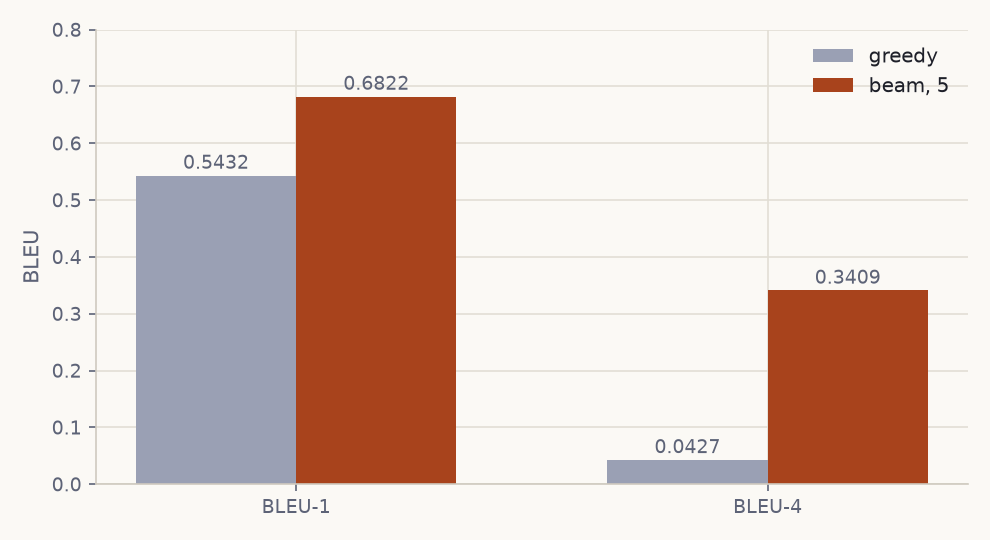

[A classifier picks one label from a fixed list. This model picks a word from
2,512 at each of up to thirty steps, decides for itself when to stop, and can
show you which part of the photograph it was looking at for every one of
them.]{.lead-in}

That last part is the interesting half, and it is the half that is easiest to
get wrong. An attention layer given a single image vector has one place to look,
so its weights are 1 by construction: a heat map that means nothing, over a
model that could still be scoring well. Making attention *real* is what the
first half of this page is about; the panel further down is what it buys you.

Write $V$ for that vocabulary and $T$ for the length the model settles on. The
output space is then $\lvert V \rvert^T$ possible sequences, and $T$ is not
known before decoding starts. Scoring that space directly is out of reach, so
the distribution over sequences is factorised by the chain rule into $T$
conditionals, each over a single token:

$$
p(y_{1:T} \mid I) \;=\; \prod_{t=1}^{T} p\bigl(y_t \mid y_{<t},\, I\bigr)
$$

This factorisation is the design. It says the model needs one component that
encodes $I$, one that maintains a representation of the prefix $y_{<t}$, and one
that maps the pair to a distribution over $V$. Those become the encoder, the
recurrent decoder and the output projection. The same factorisation sets the
training objective and the decoding algorithm.

```{=html}
<figure class="diagram">
<svg viewBox="0 0 900 196" role="img" aria-labelledby="ov-t ov-d" xmlns="http://www.w3.org/2000/svg">
<title id="ov-t">The factorisation as an architecture</title>
<desc id="ov-d">An image is encoded into 196 patch tokens. An attention layer forms a context vector from them at each step. An LSTM decoder consumes that context with the previous token and emits a distribution over the vocabulary, halting on the end token.</desc>
<defs><marker id="ar2" viewBox="0 0 10 10" refX="9" refY="5" markerWidth="7" markerHeight="7" orient="auto"><path d="M0 0 L10 5 L0 10 z" class="d-head"/></marker></defs>
<rect class="d-img" x="6" y="58" width="124" height="72" rx="5"/>
<text class="d-label" x="68" y="90">I</text>
<text class="d-small" x="68" y="110">3&#215;224&#215;224</text>
<path class="d-arrow" marker-end="url(#ar2)" d="M134 94 H182"/>
<rect class="d-box" x="186" y="58" width="134" height="72" rx="5"/>
<text class="d-label" x="253" y="86">encoder</text>
<text class="d-small" x="253" y="105">ViT-B/16, frozen 0&#8211;7</text>
<text class="d-small" x="253" y="121">a &#8712; R^(196&#215;512)</text>
<path class="d-arrow" marker-end="url(#ar2)" d="M324 94 H372"/>
<rect class="d-box" x="376" y="58" width="134" height="72" rx="5"/>
<text class="d-label" x="443" y="86">attention</text>
<text class="d-small" x="443" y="105">8 heads, d_k = 64</text>
<text class="d-small" x="443" y="121">z(t) &#8712; R^1024</text>
<path class="d-arrow" marker-end="url(#ar2)" d="M514 94 H562"/>
<rect class="d-box" x="566" y="58" width="134" height="72" rx="5"/>
<text class="d-label" x="633" y="86">decoder</text>
<text class="d-small" x="633" y="105">LSTM, h &#8712; R^1024</text>
<text class="d-small" x="633" y="121">one factor per step</text>
<path class="d-arrow" marker-end="url(#ar2)" d="M704 94 H752"/>
<rect class="d-word" x="756" y="58" width="138" height="72" rx="5"/>
<text class="d-label" x="825" y="86">p(y(t) | &#183;)</text>
<text class="d-small" x="825" y="110">halts on &lt;eos&gt;</text>
<path class="d-arrow d-dash" d="M633 134 V166 H443 V134"/>
<text class="d-small" x="538" y="184">h(t&#8722;1) re-queries the attention at every step</text>
</svg>
<figcaption>One component per term in the factorisation: the encoder conditions on <em>I</em>, the LSTM state summarises the prefix <em>y</em>(&lt;t), and the read-out maps the pair to a distribution over the vocabulary.</figcaption>
</figure>
```

Everything below follows that structure, in order, with the shape of each
tensor stated as it appears. The
[notebook](https://github.com/O-2wice/image-captioning-flickr8k/blob/main/notebooks/image-captioning.ipynb)
implements it and runs end to end in Colab; a completed twenty-epoch run
supplies every number on this page.

[](https://colab.research.google.com/github/O-2wice/image-captioning-flickr8k/blob/main/notebooks/image-captioning.ipynb)
&nbsp;
[Browse the repository](https://github.com/O-2wice/image-captioning-flickr8k)

```{=html}
<div class="scoreboard">
  <div class="sb-head">Held-out test split · 1,214 images · beam search, width 5</div>
  <div class="sb-row">
    <div class="sb-cell"><span class="sb-n">0.6557</span><span class="sb-l">BLEU-1</span></div>
    <div class="sb-cell"><span class="sb-n">0.4504</span><span class="sb-l">BLEU-2</span></div>
    <div class="sb-cell"><span class="sb-n">0.3063</span><span class="sb-l">BLEU-3</span></div>
    <div class="sb-cell"><span class="sb-n">0.2036</span><span class="sb-l">BLEU-4</span></div>
  </div>
  <div class="sb-foot">Zero-shot BLIP on the same images, same references, same tokenizer:
  <b>0.6162 / 0.4427 / 0.3057 / 0.2080</b></div>
</div>
```


## Notation

| Symbol | Meaning | Value here |
| --- | --- | --- |
| $I$ | input image | $3 \times 224 \times 224$ |
| $N$ | number of encoder patch tokens | $196$ |
| $D$ | ViT hidden width | $768$ |
| $d$ | projected feature width | $512$ |
| $d_h$ | decoder hidden width | $1024$ |
| $d_a$ | attention width | $512$ |
| $H$ | attention heads | $8$ |
| $\lvert V \rvert$ | vocabulary size | $2{,}512$ |
| $T$ | caption length in tokens | $\le 30$ |

## The supervision signal

Flickr8k holds **8,091 photographs and 40,455 captions**. Every image carries exactly five,
written independently. The corpus runs to 437,451 word tokens
over 8,446 distinct types, and a caption averages 10.8 words (median 10, 95th
percentile 18, longest 36).

Those five are not redundancy. They say the target is a *distribution over
descriptions* rather than a single string. For one image:

{#fig-references}

Two consequences follow, and they pull in opposite directions.

**Evaluation** must credit any adequate description, so metrics score a
hypothesis against the full reference set $R_i = \{r_i^{(1)}, \dots,
r_i^{(5)}\}$. **Training** by maximum likelihood requires a single target
sequence per example, because the cross-entropy at step $t$ is defined against
one token.

The notebook resolves this asymmetry by split. The training set samples
$r \sim \mathrm{Uniform}(R_i)$ on each access, which acts as a mild
regulariser over paraphrase. The validation and test sets fix $r_i^{(1)}$.

That second choice matters more than it appears. Model selection and early
stopping both read validation loss. If the validation target were resampled
each epoch, the sequence $\{\mathcal{L}_{\text{val}}^{(e)}\}_e$ would contain
variance from target resampling as well as from the parameters, and
$\arg\min_e \mathcal{L}_{\text{val}}^{(e)}$ would partly select for a
favourable draw. Fixing the reference makes the validation loss a function of
the parameters alone.

The partition itself:

| Split | Images | Captions |
| --- | ---: | ---: |
| Train | 5,663 | 28,315 |
| Validation | 1,214 | 6,070 |
| Test | 1,214 | 6,070 |

::: {.term}
**Split protocol.** A 70/15/15 partition seeded at 42, taken over image
identities rather than over image–caption pairs. Splitting over pairs would put
different captions of the same photograph on both sides of the boundary, which
leaks test images into training.
:::

{#fig-batch}

### Tokenisation and the vocabulary

Captions are lowercased and word-tokenised. The vocabulary keeps types with
frequency $\ge 5$ **counted on the training split alone**; counting across all
splits would leak test-set lexical statistics into the model.

That threshold applied to the full corpus would keep 2,971 of the 8,446 types
and still cover 97.90% of tokens. Restricted to the 28,315 training captions it
yields **2,512 entries**, the four reserved symbols included, so 2,508 words,
and everything else maps to `<unk>`.

| Token | Role |
| --- | --- |
| `<sos>` | initial decoder input $y_0$, before any token is emitted |
| `<eos>` | absorbing symbol; emitting it defines $T$ |
| `<pad>` | batch alignment filler, masked out of the loss |
| `<unk>` | image of every out-of-vocabulary type |

The frequency threshold trades coverage against estimation quality. A type
appearing twice supplies two gradient signals to a $d$-dimensional embedding,
which is not enough to place it meaningfully, while still contributing
$d$ parameters and an opportunity to overfit. Mapping the tail to `<unk>`
concentrates the capacity on types the data can actually constrain.

`<eos>` makes $T$ a learned quantity. The model
is never told the caption length; it induces a halting distribution, and
mis-calibrated halting shows up as captions that terminate early or run on.

::: {.term}
**Padding and loss masking.** Sequences in a minibatch are padded to
$T_{\max}$. The loss sums only over positions where the target is not `<pad>`.
Without the mask, the model receives gradient for predicting padding, which is
trivially learnable and dilutes the useful signal.
:::

## Encoder: ViT-B/16 patch features

The encoder is a Vision Transformer pretrained on ImageNet.
It reshapes $I \in \mathbb{R}^{3 \times 224 \times 224}$ into non-overlapping
$16 \times 16$ patches, giving

$$
N \;=\; \frac{224 \times 224}{16 \times 16} \;=\; 196
$$

tokens arranged on a $14 \times 14$ lattice. Each is linearly embedded to
$\mathbb{R}^{768}$, summed with a positional embedding, and passed through 12
pre-norm transformer blocks. The output is $a \in \mathbb{R}^{196 \times 768}$,
plus a prepended class token $a_{\text{cls}}$.

{#fig-patches}

The positional embeddings preserve the correspondence between token index and
image region through every block. This is the property the rest of the model
depends on: any distribution over the 196 tokens can be reshaped to
$14 \times 14$ and resampled to image resolution.

A ViT used for classification discards $a$ and keeps $a_{\text{cls}}$. Taking
that route here collapses the conditioning signal to a single vector, and an
attention distribution over one position satisfies $\alpha = 1$ identically:
the softmax is degenerate and carries no information about the query. The
encoder therefore returns the patch tokens and drops $a_{\text{cls}}$.

A projection maps each token to the decoder's width,

::: {.callout-note collapse="true" title="the projection, in full"}
$$
\tilde{a}_i \;=\; \mathrm{BN}\bigl(\mathrm{Dropout}(\mathrm{ReLU}(W_p a_i + b_p))\bigr),
\qquad W_p \in \mathbb{R}^{512 \times 768}
$$
:::

yielding $\tilde{a} \in \mathbb{R}^{196 \times 512}$. Batch normalisation is
applied over the feature axis with the patch axis folded into the batch, so the
statistics are computed across $B \cdot 196$ vectors.

::: {.term}
**Partial fine-tuning.** The last four of twelve blocks are unfrozen; blocks 0–7
and the patch embedding stay fixed. Early transformer blocks encode
low-level and generic structure that transfers across datasets, while later
blocks encode dataset-specific semantics that benefit from adapting. Freezing the
early stack also removes their parameters, gradients and optimiser moments from
memory, which is what makes fine-tuning viable at this batch size.
:::

## Attention over the patch lattice

The decoder needs a different view of the image at different steps: the token
*dog* and the token *grass* are supported by different regions. A fixed
conditioning vector forces one representation to serve every step.
Attention replaces it with a query-dependent convex combination.

At step $t$ the previous hidden state $h_{t-1} \in \mathbb{R}^{1024}$ forms a
query, and the patch features form keys and values:

::: {.callout-note collapse="true" title="the three projections"}
$$
q_t = W_q h_{t-1}, \qquad k_i = W_k \tilde{a}_i, \qquad v_i = W_v \tilde{a}_i
$$
:::

with $W_q \in \mathbb{R}^{512 \times 1024}$ and $W_k, W_v \in \mathbb{R}^{512
\times 512}$. Scaled dot-product attention gives the weights

$$
\alpha_{t,i} \;=\; \frac{\exp\!\left( q_t^{\top} k_i / \sqrt{d_k} \right)}
{\sum_{j=1}^{196} \exp\!\left( q_t^{\top} k_j / \sqrt{d_k} \right)},
\qquad
z_t \;=\; \sum_{i=1}^{196} \alpha_{t,i}\, v_i
$$

The $1/\sqrt{d_k}$ scaling is not cosmetic. For $q, k$ with independent
zero-mean unit-variance components, $q^{\top}k$ has variance $d_k$; without
rescaling, the logits grow with dimension, the softmax saturates, and its
Jacobian vanishes. Here $d_k = d_a / H = 512/8 = 64$.

The computation runs in $H = 8$ heads with separate projections, concatenated
and mapped back to $\mathbb{R}^{1024}$. Distinct heads can place mass on
distinct regions at the same step, so the context is not restricted to a single
unimodal focus.

Because $\sum_i \alpha_{t,i} = 1$ over the 196 lattice positions, the vector
$\alpha_t$ reshapes to $14 \times 14$ and upsamples to $224 \times 224$. This is
the model's only directly interpretable internal quantity: it states which
regions supported each emitted token. It is a description of the computation,
not a causal claim about the prediction.

{#fig-attention}

```{=html}
<figure class="diagram">
<svg viewBox="0 0 900 260" role="img" aria-labelledby="at-t at-d" xmlns="http://www.w3.org/2000/svg">
<title id="at-t">Scaled dot-product attention over the patch lattice</title>
<desc id="at-d">The decoder hidden state forms a query. Each of the 196 patch tokens produces a key and a value. Softmax over the scaled dot products gives weights summing to one, which both average the values into a context vector and reshape to a 14 by 14 map.</desc>
<defs><marker id="ar" viewBox="0 0 10 10" refX="9" refY="5" markerWidth="7" markerHeight="7" orient="auto"><path d="M0 0 L10 5 L0 10 z" class="d-head"/></marker></defs>
<rect class="d-box" x="6" y="98" width="132" height="60" rx="5"/>
<text class="d-label" x="72" y="123">h&#8202;(t&#8722;1)</text>
<text class="d-small" x="72" y="142">decoder state, 1024-d</text>
<path class="d-arrow" marker-end="url(#ar)" d="M142 128 H190"/>
<text class="d-small" x="166" y="118">q(t)</text>
<g transform="translate(200, 64)">
<rect class="d-img" x="0" y="0" width="128" height="128" rx="3"/>
<g class="d-grid"><path d="M32 0 V128 M64 0 V128 M96 0 V128 M0 32 H128 M0 64 H128 M0 96 H128"/></g>
<rect class="d-hot3" x="64" y="32" width="32" height="32"/>
<rect class="d-hot2" x="32" y="64" width="32" height="32"/>
<rect class="d-hot1" x="64" y="64" width="32" height="32"/>
</g>
<text class="d-small" x="264" y="212">&#945;(t) over 196 patch tokens</text>
<path class="d-arrow" marker-end="url(#ar)" d="M334 128 H382"/>
<rect class="d-box" x="386" y="98" width="140" height="60" rx="5"/>
<text class="d-label" x="456" y="123">z(t)</text>
<text class="d-small" x="456" y="142">context, 1024-d</text>
<path class="d-arrow" marker-end="url(#ar)" d="M530 128 H578"/>
<rect class="d-word" x="582" y="98" width="130" height="60" rx="5"/>
<text class="d-label" x="647" y="123">y(t)</text>
<text class="d-small" x="647" y="142">sampled from softmax</text>
<path class="d-arrow d-dash" d="M647 162 V196 H456"/>
<text class="d-small" x="790" y="116">the same &#945;(t),</text>
<text class="d-small" x="790" y="134">reshaped 14&#215;14,</text>
<text class="d-small" x="790" y="152">is the attention map</text>
</svg>
<figcaption>At each step the decoder state queries the 196 patch tokens. The resulting distribution both forms the context vector and, reshaped to the lattice, gives the attention map.</figcaption>
</figure>
```

## Decoder: an LSTM over the factorised conditionals

Each factor $p(y_t \mid y_{<t}, I)$ is realised by an LSTM cell
whose state summarises the prefix. The cell is stepped explicitly rather than
run as a sequence layer, because $z_t$ depends on $h_{t-1}$ and must be
recomputed between steps.

The state is initialised from the mean patch feature, giving a global summary
before attention narrows it:

::: {.callout-note collapse="true" title="initialising the LSTM state"}
$$
h_0 = W_h \left( \frac{1}{196}\sum_{i=1}^{196} \tilde{a}_i \right),
\qquad
c_0 = W_c \left( \frac{1}{196}\sum_{i=1}^{196} \tilde{a}_i \right)
$$
:::

The input at step $t$ concatenates the embedded previous token with the context,
$x_t = [\,E y_{t-1} \,;\, z_t\,] \in \mathbb{R}^{512 + 1024}$, and the cell
applies its gates:

::: {.callout-note collapse="true" title="the LSTM gates"}
$$
\begin{aligned}
f_t &= \sigma(W_f x_t + U_f h_{t-1} + b_f) &\quad c_t &= f_t \odot c_{t-1} + i_t \odot g_t \\
i_t &= \sigma(W_i x_t + U_i h_{t-1} + b_i) &\quad h_t &= o_t \odot \tanh(c_t) \\
o_t &= \sigma(W_o x_t + U_o h_{t-1} + b_o) & & \\
g_t &= \tanh(W_g x_t + U_g h_{t-1} + b_g) & &
\end{aligned}
$$
:::

The additive update to $c_t$, gated by $f_t$, is what gives the LSTM a gradient
path across many steps that does not decay multiplicatively, which is the
difficulty a plain RNN has over caption-length sequences.

Logits follow from a linear read-out, $\ell_t = W_{\text{out}} h_t \in
\mathbb{R}^{|V|}$, and $p(y_t \mid y_{<t}, I) = \mathrm{softmax}(\ell_t)$.

<ul class="steps">
<li><span class="n">0</span> input <code>&lt;sos&gt;</code></li>
<li class="emit"><span class="n">1</span> a</li>
<li class="emit"><span class="n">2</span> brown</li>
<li class="emit"><span class="n">3</span> dog</li>
<li class="emit"><span class="n">4</span> runs</li>
<li class="emit"><span class="n">5</span> through</li>
<li class="emit"><span class="n">6</span> the</li>
<li class="emit"><span class="n">7</span> grass</li>
<li class="stop"><span class="n">8</span> halt on <code>&lt;eos&gt;</code></li>
</ul>

## The training objective

Maximum likelihood over the factorisation is cross-entropy summed over
positions. With label smoothing at $\varepsilon = 0.1$, the
target distribution at each step is

::: {.callout-note collapse="true" title="the smoothed target distribution"}
$$
q'(k \mid y_t) \;=\; (1-\varepsilon)\,\delta_{k, y_t} \;+\; \frac{\varepsilon}{|V|}
$$
:::

and the per-example loss, masked to non-padding positions, is

::: {.callout-note collapse="true" title="the masked loss"}
$$
\mathcal{L} \;=\; -\frac{1}{\sum_t m_t} \sum_{t=1}^{T} m_t
\sum_{k=1}^{|V|} q'(k \mid y_t)\, \log p(k \mid y_{<t}, I),
\qquad m_t = \mathbb{1}[y_t \neq \texttt{<pad>}]
$$
:::

Smoothing is motivated directly by the five-reference structure. The
one-hot target asserts that the sampled reference is the only admissible
continuation, when in fact *dog* and *puppy* are both supported. Driving
$p \to 1$ on one arbitrary draw produces a model whose confidence is not
calibrated to the ambiguity actually present in the data.

### Optimisation

AdamW decouples $L_2$ regularisation from the adaptive moment
estimates, so weight decay $\lambda = 10^{-5}$ acts as intended rather than
being rescaled by the per-parameter second moment. The base rate is
$\eta = 3 \times 10^{-4}$.

The schedule is cosine annealing with warm restarts, which
within restart period $T_i$ follows

::: {.callout-note collapse="true" title="the cosine schedule"}
$$
\eta_t \;=\; \eta_{\min} + \tfrac{1}{2}\,(\eta_{\max} - \eta_{\min})
\left(1 + \cos\!\left(\pi \frac{T_{\text{cur}}}{T_i}\right)\right)
$$
:::

with $T_0 = 10$, $T_{\text{mult}} = 2$, $\eta_{\min} = 10^{-6}$. The restarts
produce discontinuities in the loss curve by construction; they are not
instability.

Three further mechanisms are standard but interact, so their order matters.
Mixed precision keeps activations in `float16` with a dynamically scaled loss to
keep small gradients representable. Gradient accumulation over $k = 4$
minibatches of 32 gives an effective batch of 128 without the corresponding
memory. Gradient clipping bounds the update by rescaling when $\lVert g \rVert_2
> 1$.

The ordering constraint: the gradients must be **unscaled** before the norm is
computed, or the clipping threshold is applied to loss-scaled gradients and the
effective bound becomes the scale factor times $1$. The accumulated loss must
also be divided by the true number of minibatches in its group, which differs
from $k$ for the final partial group when the loader length is not divisible by
$k$.

### Exposure bias and scheduled sampling

Training by maximum likelihood conditions each step on the *ground-truth*
prefix, $p(y_t \mid y_{<t}^{\star}, I)$. Inference conditions on the model's own
prefix, $p(\hat{y}_t \mid \hat{y}_{<t}, I)$. The distribution of prefixes at
test time is therefore not the distribution the model was trained on. This is
**exposure bias**. Its practical signature is a model that is
fluent under teacher forcing and degrades once an early error moves it off the
data manifold, with no training experience of recovering.

Scheduled sampling interpolates between the two regimes. At step
$t$ the decoder input is drawn as

$$
\tilde{y}_{t-1} \;=\;
\begin{cases}
y_{t-1}^{\star} & \text{with probability } \epsilon_e \\[2pt]
\hat{y}_{t-1} = \arg\max_k p(k \mid \tilde{y}_{<t-1}, I) & \text{with probability } 1 - \epsilon_e
\end{cases}
$$

where the teacher-forcing rate $\epsilon_e$ decays over epochs $e$ from 1 toward
a floor. Early training keeps $\epsilon_e$ near 1, when the model's own
predictions would be uninformative; later training exposes it to its own
outputs, once those are good enough to condition on. The
substitution applies in training mode only; evaluation is always fully
autoregressive.

## Decoding

Training defines the conditionals. Decoding is the separate problem of finding a
high-probability sequence under them, and exact search over $|V|^T$ is
intractable.

**Greedy decoding** takes $\hat{y}_t = \arg\max_k p(k \mid \hat{y}_{<t}, I)$ at
each step. It is $O(T)$ forward passes and optimises each factor in isolation,
which does not optimise the product: a locally dominant token can precede a
low-probability continuation with no mechanism for revision.

**Beam search** maintains $B = 5$ partial hypotheses ranked by accumulated
log-probability,

$$
s(\hat{y}_{1:t}) \;=\; \sum_{\tau=1}^{t} \log p(\hat{y}_\tau \mid \hat{y}_{<\tau}, I)
$$

expanding each by its top-$B$ continuations and retaining the $B$ best. Cost is
$O(BT)$ forward passes. Because the score is a sum of negative terms, it
decreases monotonically with length, which biases beam search toward short
hypotheses and motivates length normalisation in longer-form generation.

Autoregressive decoders with limited conditioning are prone to degenerate
repetition. A repetition penalty $\rho = 1.2$ discounts a token already present
in the hypothesis. Since the scores are log-probabilities and therefore
negative, the penalty must **multiply**:

$$
s' \;=\; s + \rho \cdot \log p(\hat{y}_t \mid \cdot), \qquad \log p < 0
$$

Dividing by $\rho$ moves the score toward zero and *raises* the rank of a
repeated token, the sign error that implements the opposite of the intent.

## Evaluation

Sequence generation has no notion of exact-match accuracy: a caption sharing no
$n$-grams with any reference may still be a correct description.

BLEU scores modified $n$-gram precision against the reference
set. For order $n$, with clipping against the maximum count in any single
reference,

::: {.callout-note collapse="true" title="modified n-gram precision, with clipping"}
$$
p_n \;=\; \frac{\sum_{C \in \text{cand}} \sum_{g \in n\text{-}\mathrm{grams}(C)}
\min\bigl(\mathrm{count}(g),\, \max_r \mathrm{count}_r(g)\bigr)}
{\sum_{C \in \text{cand}} \sum_{g \in n\text{-}\mathrm{grams}(C)} \mathrm{count}(g)}
$$
:::

Precision alone rewards short output, so a brevity penalty applies, with $c$ the
candidate length and $r$ the effective reference length:

$$
\mathrm{BP} = \begin{cases} 1 & c > r \\ e^{1 - r/c} & c \le r \end{cases}
\qquad
\mathrm{BLEU} = \mathrm{BP} \cdot \exp\left( \sum_{n=1}^{4} w_n \log p_n \right)
$$

The weights are uniform over the orders scored: $w_n = 1/3$ for BLEU-3, $1/4$
for BLEU-4. Because the geometric mean is zero whenever any $p_n = 0$, sentence
counts are smoothed; the notebook uses NLTK's method 4.

These formulas are easier to believe once you have moved them. The panel below
scores whatever you type against the five references listed in it, the real ones
for the gift-bag photograph near the top of the page. Nothing is smoothed, so a
zero stays a zero.

```{=html}
<div class="playground" id="bleu-play">
  <div class="ex-head">
    <span class="ex-title">BLEU, live</span>
    <span class="ex-sub">edit the caption and watch the n-gram precisions move</span>
  </div>
  <div class="pg-body">
    <div class="pg-refs" id="pg-refs"></div>
    <label class="ex-label" for="pg-input">your caption</label>
    <input id="pg-input" type="text" spellcheck="false"
           value="a brown dog with its head in a gift bag">
    <div class="pg-try">
      try: <button data-c="a dog">a dog</button>
      <button data-c="a dog has its head inside a red and green gift bag">an exact reference</button>
      <button data-c="a dog has its head inside a red and green present bag">one word off</button>
      <button data-c="a small animal investigating a colourful sack of presents">same meaning, new words</button>
    </div>
    <div class="pg-out" id="pg-out"></div>
  </div>
</div>
<script>
(function () {
  const REFS = [
    "A dog has its head inside a red and green gift bag .",
    "A pet playfully investigates the contents of a gift bag .",
    "Little brown dog sticking head in a coloful bag filled with cloth .",
    "The dog has his face in the bag of Christmas presents .",
    "The red-brown dog digs his nose to investigate a holiday gift bag ."
  ];
  const input = document.getElementById('pg-input');
  const out = document.getElementById('pg-out');
  const refsEl = document.getElementById('pg-refs');
  if (!input) return;

  refsEl.innerHTML = REFS.map(r =>
    '<div class="pg-ref"><span>ref</span>' + r.replace(/ \.$/, '') + '</div>').join('');

  const tok = s => s.toLowerCase().match(/[a-z']+/g) || [];
  const grams = (t, n) => {
    const m = new Map();
    for (let i = 0; i + n <= t.length; i++) {
      const k = t.slice(i, i + n).join(' ');
      m.set(k, (m.get(k) || 0) + 1);
    }
    return m;
  };

  function score() {
    const cand = tok(input.value);
    const refs = REFS.map(tok);
    if (!cand.length) { out.innerHTML = ''; return; }
    const ps = [];
    for (let n = 1; n <= 4; n++) {
      const c = grams(cand, n);
      const capped = new Map();
      refs.forEach(r => grams(r, n).forEach((v, k) =>
        capped.set(k, Math.max(capped.get(k) || 0, v))));
      let clipped = 0, total = 0;
      c.forEach((v, k) => { total += v; clipped += Math.min(v, capped.get(k) || 0); });
      ps.push(total ? clipped / total : 0);
    }
    const closest = refs.reduce((a, r) =>
      Math.abs(r.length - cand.length) < Math.abs(a - cand.length) ? r.length : a, refs[0].length);
    const bp = cand.length > closest ? 1 : Math.exp(1 - closest / cand.length);
    const bleu = n => {
      const w = ps.slice(0, n);
      if (w.some(p => p === 0)) return 0;
      return bp * Math.exp(w.reduce((s, p) => s + Math.log(p), 0) / n);
    };
    const bar = p => '<span class="pg-bar"><i style="width:' + (p * 100).toFixed(0) + '%"></i></span>';
    out.innerHTML =
      '<table class="pg-table"><thead><tr><th>n</th><th>precision p<sub>n</sub></th>' +
      '<th></th><th>BLEU-n</th></tr></thead><tbody>' +
      ps.map((p, i) =>
        '<tr><td>' + (i + 1) + '</td><td class="pg-num">' + p.toFixed(4) + '</td><td>' +
        bar(p) + '</td><td class="pg-num' + (bleu(i + 1) === 0 ? ' zero' : '') + '">' +
        bleu(i + 1).toFixed(4) + '</td></tr>').join('') +
      '</tbody></table>' +
      '<div class="pg-note">' + cand.length + ' words, closest reference ' + closest +
      ', brevity penalty ' + bp.toFixed(4) +
      (ps.some(p => p === 0) ? ' &middot; <b>a precision of zero zeroes every BLEU above it</b>' : '') +
      '</div>';
  }

  input.addEventListener('input', score);
  document.querySelectorAll('.pg-try button').forEach(b =>
    b.onclick = () => { input.value = b.dataset.c; score(); });
  score();
})();
</script>
```

Reading BLEU-1 against BLEU-4 separates two abilities. BLEU-1 responds to
lexical selection: whether the right entities were named. BLEU-4 responds to
local word order and phrasing. A model with adequate vocabulary and weak
sequential structure shows a steep decline across the orders.

::: {.term}
**What BLEU does not measure.** BLEU is $n$-gram overlap with a finite reference
set. A description that is accurate but lexically distinct from all five
references scores low, and a fluent description that names the wrong entity can
score well on BLEU-1. The metric is a proxy; the generated captions and the
attention maps are the evidence that tells you which kind of score you have.
:::

### A pretrained reference point

Absolute BLEU values on Flickr8k are not interpretable without a comparison.
BLIP supplies one: a vision–language model pretrained with
bootstrapped captions on web-scale image–text pairs, evaluated here with
published weights and no Flickr8k training.

The comparison is between systems with different training histories, not
between architectures under matched conditions. Its validity rests on holding
the protocol fixed on both sides: the same test images, the same reference
sets, the same decoding configuration, and, easy to overlook, the same
tokenisation. Scoring one system's output with a whitespace split while the
references are word-tokenised leaves punctuation attached to adjacent words and
suppresses every $n$-gram containing it, penalising the measurement rather than
the model.

## Training dynamics

Twenty epochs. Batch 32, accumulated to an effective 128. 45,727,184 trainable
parameters once the last four ViT blocks are unfrozen.

{#fig-loss}

Validation loss sits *below* training loss for the whole run. The two are
measured under different conditions: training sees augmented images, a sampled
reference, token dropout, label smoothing and scheduled sampling; validation
sees clean transforms, a fixed reference and teacher forcing. The training task
is harder, so its loss is higher.

The run ends at 3.8039, still falling, with early stopping never triggered.

::: {.verdict}
**The schedule ran out before the model did.** Nothing here looks like
convergence, so every number below is a floor.
:::

### The two criteria disagree

{#fig-bleu}

BLEU-4 peaks at **epoch 16 (0.1748)** and ends at **0.1508**. Validation loss
improves to the last epoch. They point at different checkpoints.

Cross-entropy rewards probability mass on the reference token. BLEU rewards
n-grams that survive decoding. A model can sharpen its distributions while its
decoded output drifts toward safe, generic phrasing that matches fewer 4-grams.
The brief asks for validation loss, so epoch 20 is kept.

## Decoding moves the number more than the weights do

{#fig-decoding}

| | BLEU-1 | BLEU-4 |
| --- | ---: | ---: |
| Greedy | 0.5432 | 0.0427 |
| Beam, width 5 | **0.6822** | **0.3409** |

An eightfold BLEU-4 change from touching no parameter. Greedy commits to the
top token at each step and this decoder falls into repetition loops it cannot
escape. Five live hypotheses let a second-best token prove itself, and the
repetition penalty stops the beams collapsing onto one loop. Sharper per-token
distributions would narrow that gap.

{#fig-greedy-beam}

## Where the model looks

{#fig-attention-run}

The grounding is real. *black* and *dog* settle on the animal in row two;
*dog* lands on the terrier's face in row three.

The panel below runs the same checkpoint on three more photographs. Pick a word
and its own distribution over the 196 patches is drawn on the image. The
weights are the model's, exported from the run, not an illustration.

```{=html}
<div class="explorer" id="attn-explorer">
  <div class="ex-head">
    <span class="ex-title">Attention explorer</span>
    <span class="ex-sub">real weights from the trained checkpoint, pick a word</span>
  </div>
  <div class="ex-body">
    <div class="ex-stage">
      
      <canvas id="ex-canvas" width="14" height="14"></canvas>
    </div>
    <div class="ex-side">
      <div class="ex-label">image</div>
      <div class="ex-thumbs" id="ex-thumbs"></div>
      <div class="ex-label">generated caption</div>
      <div class="ex-words" id="ex-words"></div>
      <div class="ex-stats" id="ex-stats"></div>
    </div>
  </div>
</div>
<script>
(function () {
  const root = document.getElementById('attn-explorer');
  if (!root) return;
  const img = document.getElementById('ex-img');
  const cvs = document.getElementById('ex-canvas');
  const ctx = cvs.getContext('2d');
  const wordsEl = document.getElementById('ex-words');
  const thumbsEl = document.getElementById('ex-thumbs');
  const statsEl = document.getElementById('ex-stats');
  let data = [], cur = 0, step = 0;

  // inferno-like ramp, so the overlay reads the same way as the static figures
  const RAMP = [[0,0,4],[40,11,84],[101,21,110],[159,42,99],[212,72,66],[245,125,21],[250,193,39],[252,255,164]];
  function colour(t) {
    const x = Math.max(0, Math.min(1, t)) * (RAMP.length - 1);
    const i = Math.floor(x), f = x - i, a = RAMP[i], b = RAMP[Math.min(i + 1, RAMP.length - 1)];
    return [a[0] + (b[0] - a[0]) * f, a[1] + (b[1] - a[1]) * f, a[2] + (b[2] - a[2]) * f];
  }

  function draw() {
    const rec = data[cur]; if (!rec) return;
    const map = rec.maps[step] || [];
    const max = Math.max.apply(null, map) || 1;
    const im = ctx.createImageData(14, 14);
    for (let i = 0; i < 196; i++) {
      const v = (map[i] || 0) / max;
      const c = colour(v);
      im.data[i*4] = c[0]; im.data[i*4+1] = c[1]; im.data[i*4+2] = c[2];
      im.data[i*4+3] = 70 + 165 * v;           // low weights stay transparent
    }
    ctx.putImageData(im, 0, 0);
    const top = map.map((v, i) => [v, i]).sort((a, b) => b[0] - a[0])[0] || [0, 0];
    const pct = (top[0] * 100).toFixed(1);
    statsEl.innerHTML = '196 weights, summing to 1. Strongest patch: <b>#' + top[1] +
      '</b> at <b>' + pct + '%</b>, row ' + Math.floor(top[1] / 14) + ', column ' + (top[1] % 14) + '.';
  }

  function renderWords() {
    const rec = data[cur];
    wordsEl.innerHTML = '';
    rec.words.forEach((w, i) => {
      const b = document.createElement('button');
      b.className = 'ex-word' + (i === step ? ' on' : '');
      b.textContent = w;
      b.onclick = () => { step = i; renderWords(); draw(); };
      wordsEl.appendChild(b);
    });
  }

  function select(i) {
    cur = i; step = 0;
    img.src = 'assets/explore/' + data[i].file;
    Array.from(thumbsEl.children).forEach((t, k) => t.classList.toggle('on', k === i));
    renderWords(); draw();
  }

  fetch('assets/explore/attention.json')
    .then(r => r.json())
    .then(j => {
      data = j;
      j.forEach((rec, i) => {
        const t = document.createElement('img');
        t.src = 'assets/explore/' + rec.file;
        t.className = 'ex-thumb';
        t.alt = 'photograph ' + (i + 1);
        t.onclick = () => select(i);
        thumbsEl.appendChild(t);
      });
      select(0);
    })
    .catch(() => { root.style.display = 'none'; });
})();
</script>
```

The explorer decodes with a beam, so its captions hold together. @fig-attention-run
above does not: those captions come from the plotting function's argmax loop,
and its first row reads *a man in a a a a a a*. Same weights, same attention.
The difference is entirely in how the words were chosen.

## The captions

{#fig-captions}

Set side by side, with the failures marked:

```{=html}
<div class="captions">
  <div class="cap">
    <div class="cap-ref"><span>reference</span>a black dog plays in the water</div>
    <div class="cap-ours"><span>custom</span>a black dog swimming in water</div>
    <div class="cap-blip"><span>BLIP</span>there is a dog that is playing in the water with a frisbee</div>
    <div class="cap-note">Subject, action and setting correct. BLIP invents a frisbee.</div>
  </div>
  <div class="cap">
    <div class="cap-ref"><span>reference</span>A black and white dog plays in the water</div>
    <div class="cap-ours"><span>custom</span>a black and white dog is through water</div>
    <div class="cap-blip"><span>BLIP</span>there is a black and white dog in the water playing with a frisbee</div>
    <div class="cap-note">Every content word right, syntax broken. Frisbee again.</div>
  </div>
  <div class="cap">
    <div class="cap-ref"><span>reference</span>A German Shepherd chases another with a stick in his mouth</div>
    <div class="cap-ours"><span>custom</span>two dogs are running in the field</div>
    <div class="cap-blip"><span>BLIP</span>there are two dogs that are running in the grass with a frisbee in their mouth</div>
    <div class="cap-note">True but thin: the stick is gone. BLIP turns it into a frisbee.</div>
  </div>
  <div class="cap">
    <div class="cap-ref"><span>reference</span>A bride and groom stand in front of a church display</div>
    <div class="cap-ours cap-bad"><span>custom</span>two girls are in a &lt;unk&gt;</div>
    <div class="cap-blip"><span>BLIP</span>there is a man and a woman standing in front of a church altar</div>
    <div class="cap-note">The failure case. <code>&lt;unk&gt;</code> reaches the user. BLIP names the scene; this does not.</div>
  </div>
</div>
```

The `<unk>` leak is the frequency-5 vocabulary threshold meeting a rare word.
It is visible to anyone using the model, which makes it the most obvious thing
to fix.

## Against BLIP

{#fig-comparison}

| | Custom | BLIP, zero-shot | Δ |
| --- | ---: | ---: | ---: |
| BLEU-1 | **0.6557** | 0.6162 | +0.0395 |
| BLEU-2 | **0.4504** | 0.4427 | +0.0077 |
| BLEU-3 | **0.3063** | 0.3057 | +0.0006 |
| BLEU-4 | 0.2036 | **0.2080** | −0.0044 |
| Average | **0.4040** | 0.3931 | +0.0109 |

Leading on three of four is not beating BLIP. The custom model learned
Flickr8k's register (short, present tense, *a black dog …*), and BLEU scores
overlap with Flickr8k references. BLIP writes *there is a dog that is …* and
loses overlap for phrasing that describes the image perfectly well. Its wedding
caption is the best sentence on this page, and it scores below the custom
model's `<unk>`.

What the table shows: a 45M-parameter model trained for twenty epochs on eight
thousand images matches these references about as closely as a large pretrained
vision–language model does.

## Verdict

::: {.verdict}
**BLEU-4 of 0.2036, with validation loss still falling at the final epoch.**
It names the subject, action and setting on straightforward images, and the
attention maps land on the right pixels. It breaks syntax on longer sentences,
emits `<unk>` for rare words, and loses coherence without a beam.
:::

Three things would move it, in order of expected return:

1. **Train longer.** Validation loss never flattened.
2. **Widen the vocabulary.** The `<unk>` leak is a threshold choice, not a
   modelling limit.
3. **Tighten the decoder.** An eightfold greedy-to-beam gap points at flat
   per-token distributions.

The corrections hold under a real run: attention is spatially grounded and
visualisable, fine-tuning reaches the unfrozen blocks, selection follows
validation loss, and BLEU uses all five references with matched tokenisation on
both sides.
